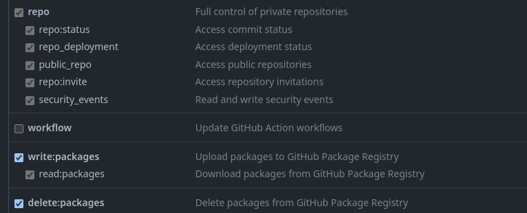

# Utilisation de docker avec github packages :

```
@Bastien-Helec
```

---

## 1. Creation de la communication entre docker et github de façon locale : 

### 1.1. Creation de la configuration github du token: 
Avant toute chose on doit créer un token d'authentification sur github. IL faut donc faire les étapes suivantes :

- [ ] Aller dans les paramètres de son compte github

- [ ] Aller dans Developer settings

- [ ] Aller dans Personal access tokens

- [ ] Config du token 

- [ ] Cocher les cases suivantes : repo, write:packages, read:packages



<i>n'oubliez pas de garder le token quelque part, il ne sera plus visible après avoir quitté la page

Le token generer va permettre de lire les packages de pouvoir les modifiers et de pouvoir les ajouter dans des repositories.</i>

### 1.2. Creation du fichier de configuration de github > docker :

Cette partie requiert une configuration spécifique via le CLI linux. Il faut donc faire les étapes suivantes :

- [ ] on va donc récupérer le token que l'on a généré précedemment et on va l'assigner a une variable d'environnement : 
```bash 
env $CR_PAT=[TOKEN]
```

- [ ] On va ensuite créer faire la connexion github docker avec l'aide de notre variable d'environnement : 
```bash
echo $CR_PAT | docker login ghcr.io -u [USERNAME] --password-stdin
```
<i> ici le username est le nom de votre compte github il n'est pas case sensitive : le username en minuscule fonctionne autant que celui qui es en majuscule.

ghcr.io est le nom du registry de github (public). 
</i>


--- 

## 2. Créer, Envoyer et Récupérer un package sur github :

### 2.1. Créer :

Ils existe plusieurs moyen de créer un package. Ici nous allons voir avec dockerfile. 

- [ ] Créer un dockerfile dans le dossier de votre choix : 
```bash
touch  ~/[YOUR_REPO]/Dockerfile
```

-[ ] Dans le fichier dockerfile indiquez principalement le nom de l'image et ça version : 
```dockerfile
FROM debian:latest
``` 

<i> Ici on ne va pas perdre de temps a créer toutes nos options, on peut ajouter d'autre options dans le dockerfile voir ici : https://docs.docker.com/engine/reference/builder/</i>

<i>L'objectif principal est de générer notre image que l'on va envoyer sur github.</i> 

- [ ] On va ensuite build notre image : 
```bash
cd ~/[YOUR_REPO]
docker build -t [TAG] .
```
<i>docker va chercher le dockerfile dans le dossier actuelle (.) et va build l'image avec le tag que l'on a indiqué.

Maintenant que notre images est créer en local on peut le lancer faire nos modifications que l'on souhaite ou rien faire. </i> 

### <a id="2.1.2">  2.1.2 Modifier l'image:  </a> 

- [ ] On va donc lancer notre image : 
```bash
docker run -it [TAG]
```

- [ ] On va ensuite faire nos modifications : 
```bash
apt-get update 
```

- [ ] On peut refermer notre docker en cours

- [ ] On va maintenant créer une nouvelle image a partir du container que docker a créer quand on a lancer notre image : 
```bash
docker commit [CONTAINER_ID] ghcr.io/[USERNAME]/[REPO]:[TAG]
``` 

<i> Une nouvelle image est donc créer.

L'image maintenant créer avec les modifications faites on peut passer a l'etapes suivantes. </i>


### 2.2. Envoyer :

Le but de cette etape est d'envoyer notre image sur github, il faut savoir que par defaut github decide que les packages sont privés. 

NB: Si vous souhaitez le rendre public sachez que ce package aura peut etre des personnes qui l'auront deja telecharger donc il ne faudra pas le supprimer des ce moment la. 

- [ ] on va donc tout d'abord initialiser notre nouvelle version du docker : 
```bash
docker tag [image_créer] ghcr.io/[USERNAME]/[REPO]:[TAG]
```

- [ ] On va ensuite push notre image sur github avec le tag specifique : 
```bash
docker push ghcr.io/[USERNAME]/[REPO]:[TAG]
```

<i> L'image est maintenant sur github, on peut donc la recuperer sur n'importe quel machine qui a docker d'installer. </i>

### 2.3. Récupérer :

Dans le cas d'une récuperation d'un package sur github et que vous voulez le renvoyer dans votre repository, sachez qu'il ne faut pas changer le nom de l'image juste le tag de l'image, sinon vous ne verrez pas la nouvelle version de l'image que vous vouliez modifier dans le repository assigné.

- [ ] On va donc pull l'image que l'on souhaite modifier : 
```bash
docker pull ghcr.io/[USERNAME]/[REPO]:[TAG]
```

- [ ] On va ensuite lancer l'image : 
```bash
docker run -it [NOM_IMAGE]:[TAG] 
```

- [ ] On va ensuite faire nos modifications : 
```bash
apt-get update 
```

- [ ] Une fois le package modifier referrez vous a l'etapes : [2.1.2 Modifier l'image](#2.1.2-modifier-l'image)


---

# All rights &copy; reserved @Bastien-Helec 2023 